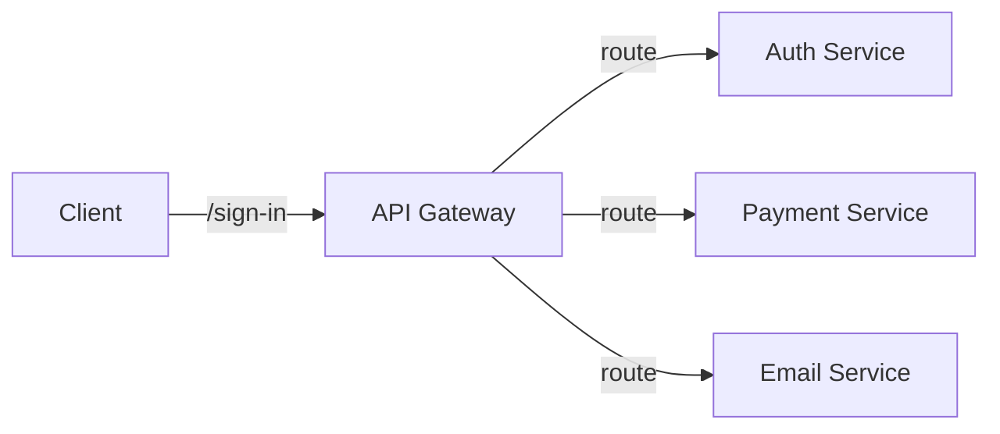
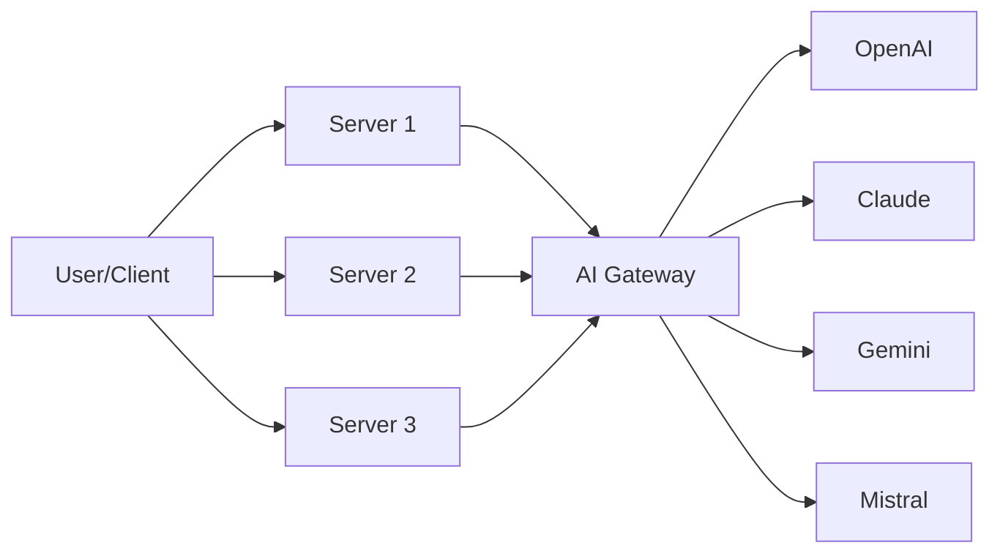
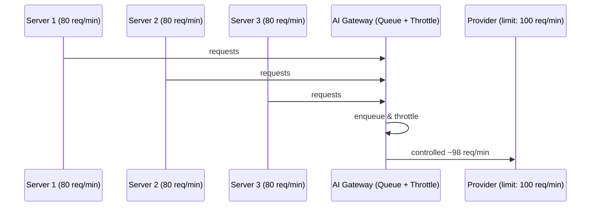

# AI Gateway — System Design Notes

> Topic: What is an AI Gateway, why it's needed, and the system design behind it
> Source: Video walkthrough (Hindi/English) on AI Gateway architecture

---

## 1. Recap: Traditional API Gateway

In a distributed / microservices system, you typically have multiple independent services:

- **Payment Service** (e.g. written in Java)
- **Auth Service** (e.g. written in Node.js)
- **Email Service** (written in some other language)

**Problem:** The client doesn't know which service to call for which resource. Exposing a separate domain per service (`auth.example.com`, `email.example.com`, ...) means the client has to track multiple domains, and it doesn't scale.

**Solution — API Gateway:** A single entry point in front of all services. Rules are defined at the gateway to route requests based on path:

- `/sign-in`, `/sign-up` → Auth Service
- `/payments/*` → Payment Service

The client only ever talks to **one endpoint**; the gateway handles routing internally.



---

## 2. The Problem Without an AI Gateway

A typical AI-powered app: Client → Server → LLM Provider (e.g. OpenAI) → Server saves to DB → Response to Client.

As systems scale, using AI naively causes several problems:

### 2.1 API Key Management
- Every server that calls an LLM provider needs its own copy of the API key.
- Rotating/changing a key means updating it **everywhere** — error-prone, easy to miss a server, causes crashes.

### 2.2 Multiple LLM Providers
- Real systems don't stick to one provider — they use **Gemini, Claude, GPT, Grok, Mistral**, etc. based on use case:
  - Simple query → OpenAI
  - Document analysis → Claude
  - Image generation → Gemini (Nano Banana models)
  - Generic/cheap tasks → Mistral

### 2.3 Fragmented Code
- Each provider has its own SDK, request/response schema:
  | Provider | Request style | Response access pattern |
  |---|---|---|
  | OpenAI | `model`, prompt-based | `response.choices[0].message.content` |
  | Gemini | `model`, `instructions` (not "prompt") | `result.message` |
  | Claude | `model`, `prompt` | `result.parsed.result` |
- Leads to messy `if/else` or `switch(provider)` logic duplicated across **every** microservice.

### 2.4 No Unified Monitoring
- No single place to track: which model is used how much, input/output tokens per model, cost, etc.

### 2.5 No Central Routing Policy
- Policy like "image request → Gemini, coding request → Claude, generic → OpenAI" has to be implemented and maintained **in every service** — high overhead.

**Root cause:** No unified layer. Each server independently decides how to call its LLM → fragmented, duplicated, unsafe.

---

## 3. Enter: The AI Gateway

Same core idea as an API Gateway, but purpose-built for LLM/AI traffic. Servers are **never allowed** to talk to LLM providers directly — everything goes through the AI Gateway.



### Unified Request/Response Contract
Instead of each provider's custom schema, the gateway exposes **one** API:

```json
// Request
{
  "model": "gpt-5.5",
  "provider": "openai",
  "instructions": "...",
  "system": "..."
}

// Response
{
  "output": "...",
  "tokens_used": 123
}
```

All internal servers just call `ai-gateway.example.com` with this single contract — they don't care which model/provider is used underneath, or how.

---

## 4. Responsibilities / Benefits of an AI Gateway

| # | Capability | What it Solves |
|---|---|---|
| 1 | **API Unification** | Single request/response schema regardless of provider (OpenAI, Claude, Gemini...) |
| 2 | **Centralized Key Management** | Only ONE gateway-level API key for clients; provider keys (OpenAI/Claude/Gemini) stored & rotated in one place |
| 3 | **Monitoring** | Since all requests are proxied through one layer, usage/cost/token tracking is centralized |
| 4 | **Trust/Security Layer** | Can restrict access to only whitelisted internal servers (network-level trust, on top of API key auth) |
| 5 | **Rate Limiting** | Coordinates rate limits across multiple servers using a shared in-memory queue (throttling), instead of each server independently hitting the provider's limit and collectively exceeding it |
| 6 | **Smart/Policy-based Routing** | Auto-select the best model per request type (e.g. `model: auto` → image request → Gemini, code request → Claude, generic → OpenAI) |
| 7 | **Guardrails (Input)** | Detect/block prompt injection or malicious/bad content before it reaches the LLM |
| 8 | **Guardrails (Output)** | Detect sensitive data in LLM responses; mask or cancel the response before returning to user |
| 9 | **Fallback Handling** | If the requested model/provider fails (e.g. OpenAI down), automatically retry with another model (e.g. Claude) |
| 10 | **Cost Optimization** | Swap out an expensive model (e.g. GPT-5.5) for a cheaper one (e.g. GPT-4o) with a single policy change across the entire system |
| 11 | **"Latest Model" Abstraction** | Just specify `latest` — gateway always resolves to the newest available model without touching every service |

### 4.1 Rate Limiting — Worked Example
- Provider limit: 100 requests/min.
- 3 servers each independently think they're within budget (e.g. 80 req/min each) → but combined = 240 req/min → limit exceeded.
- **Why:** No coordination between the 3 servers.
- **Fix:** Since the AI Gateway is the single funnel, it can maintain a shared in-memory queue, throttle outgoing requests (e.g. cap at 98 req/min), and even block excess requests.



### 4.2 Fallback — Worked Example
1. User requests `provider: openai, model: gpt-5.5`.
2. OpenAI is down / key issue / request rejected.
3. Gateway (with `fallback: true`) retries automatically using Claude (or another configured fallback).
4. Returns the response to the user — user never notices the failure.

---

## 5. Real-World AI Gateways
- **OpenRouter** — unified interface for LLM models.
- **Vercel AI Gateway**
- **Cloudflare AI Gateway** — supports dynamic routing (e.g. paid user → OpenAI, free user → cheaper model like Kimi) + fallback to Claude.
- Various **open-source LLM routers** implementing the same pattern.

---

## Interview Q&A

**Q: What problem does an AI Gateway solve that a normal API Gateway doesn't?**
A: An API Gateway routes traffic between internal services based on path/domain. An AI Gateway sits between internal services and *external LLM providers*, solving problems specific to multi-provider LLM usage: differing request/response schemas, API key sprawl, lack of unified monitoring, no coordinated rate limiting, and no central place to apply routing policy, guardrails, or fallback logic.

**Q: Why shouldn't each microservice call the LLM provider directly?**
A: It leads to duplicated provider-specific logic in every service, scattered API keys (hard to rotate safely), no centralized monitoring/rate-limiting, and no single point to enforce security/guardrail policies.

**Q: How does an AI Gateway help with rate limiting across multiple servers?**
A: Since all servers proxy requests through the single gateway, it can maintain a shared queue and throttle outgoing calls to the provider's actual limit, instead of each server independently (and unknowingly) exceeding the shared quota.

**Q: What are input and output guardrails?**
A: Input guardrails validate/filter incoming prompts for issues like prompt injection or malicious content before they reach the LLM. Output guardrails inspect the LLM's response for sensitive data and can mask or cancel it before returning to the user.

**Q: How does an AI Gateway enable cost optimization?**
A: Because model selection is centralized via policy at the gateway, swapping a model (e.g. GPT-5.5 → GPT-4o) for cost reasons requires a single config change instead of updating every service that calls the LLM.

**Q: What is "smart routing" in the context of an AI Gateway?**
A: Policy-based automatic model selection — e.g. image generation requests routed to Gemini, coding requests to Claude, generic requests to OpenAI — controlled centrally instead of hardcoded per service.

---

## Quick Revision Checklist
- [ ] API Gateway = routes traffic to internal microservices via path rules
- [ ] AI Gateway = routes/manages traffic to external LLM providers
- [ ] Problems solved: API key sprawl, fragmented SDKs/schemas, no monitoring, no coordinated rate limiting, no central policy
- [ ] Core features: unified API contract, centralized key mgmt, monitoring, trust/security layer, rate limiting (throttling via queue), smart routing, input/output guardrails, fallback, cost optimization, "latest model" abstraction
- [ ] Real examples: OpenRouter, Vercel AI Gateway, Cloudflare AI Gateway
