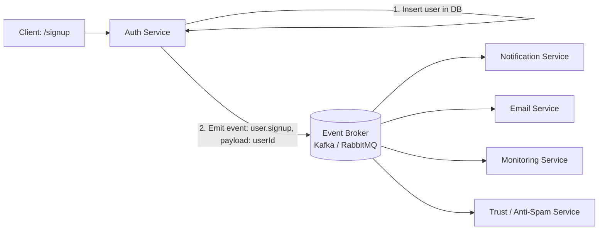
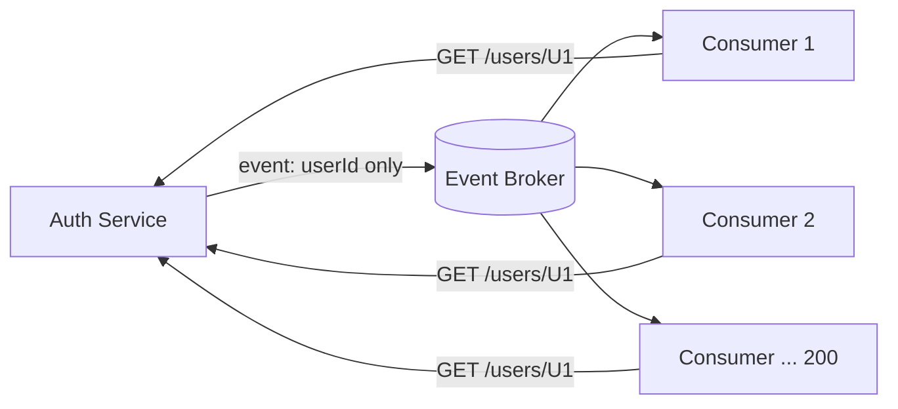
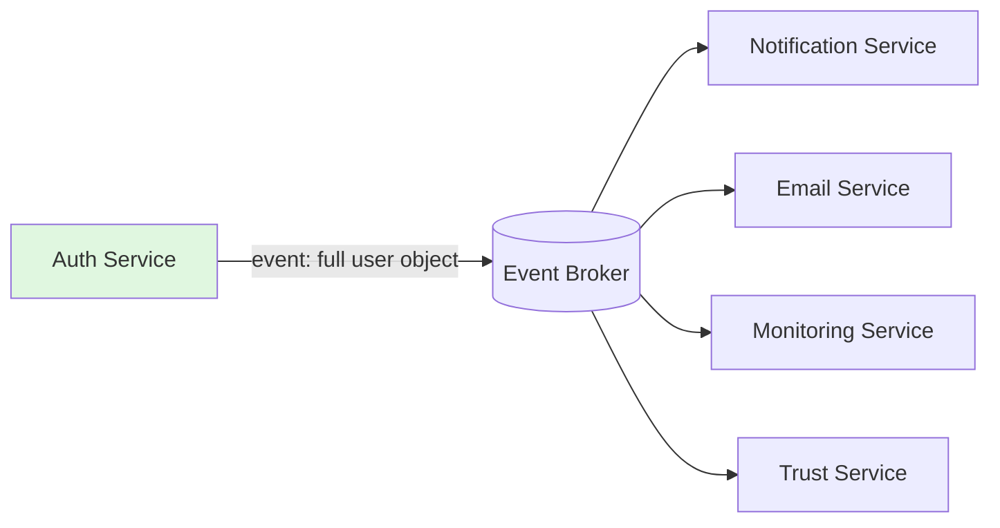

# Event-Carried State Transfer (ECST) Pattern

> **Summary:** ECST is an evolution of event-driven architecture where events carry the *full relevant state* (not just an ID/signal), so consumer services can process independently without making synchronous callback calls to the source service. This removes the hidden coupling that plain event-driven systems still have.

---

## Table of Contents

- [1. Quick Recap: Event-Driven Architecture](#1-quick-recap-event-driven-architecture)
- [2. The Problem with Plain Event-Driven Architecture](#2-the-problem-with-plain-event-driven-architecture)
- [3. What is Event-Carried State Transfer?](#3-what-is-event-carried-state-transfer)
- [4. How It Solves the Problem](#4-how-it-solves-the-problem)
- [5. Benefits](#5-benefits)
- [6. Challenges / Trade-offs](#6-challenges--trade-offs)
- [7. Comparison Table: Signal Event vs ECST](#7-comparison-table-signal-event-vs-ecst)
- [8. Interview Q&A](#8-interview-qa)
- [9. Quick Revision Checklist](#9-quick-revision-checklist)

---

## 1. Quick Recap: Event-Driven Architecture

In an event-driven system, a service performs its **critical/synchronous work first**, then **emits (broadcasts) an event** for everything else, instead of doing all steps sequentially in one service.

**Example — User Sign-up flow**

Without event-driven design (all synchronous, tightly coupled):

1. Insert user in DB
2. Send welcome email
3. Raise a notification
4. Update some metrics / analytics

If all four steps run one-after-another inside the Auth Service:
- **High coupling** — everything depends on one service.
- **Cascading failure** — if one step fails, all subsequent steps fail.
- **Slow response** — the caller has to wait for all 4 steps to finish.

**With event-driven design:**



- Auth Service only does the **critical, synchronous** step (DB insert) and then **emits** an event.
- All other services (Notification, Email, Monitoring, Trust) **subscribe** to `user.signup` and process it **asynchronously**, at their own pace.
- Auth Service is free immediately after emitting — it doesn't wait for acknowledgment.

---

## 2. The Problem with Plain Event-Driven Architecture

The event payload in the simple design above is minimal — usually just an **ID**:

```json
{
  "event": "user.signup",
  "userId": "U1"
}
```

**Problem:** Every consumer needs more than just the ID to do its job (email needs the user's email address, trust service needs signup metadata, etc.). So each consumer calls back:

```
GET /users/U1
```

If there are **200 consumer services** subscribed to `user.signup`, and **1000 users** sign up:

```
200 consumers × 1000 signups = 200,000 synchronous callback calls
                                back to the Auth Service
```



**Consequences:**
- Services are **not truly decoupled** — they still depend on Auth Service being up.
- Auth Service gets **overwhelmed** with repeated GET requests.
- If Auth Service has downtime, **all downstream services fail** to complete their work — defeating the entire purpose of going event-driven.

> **Core issue:** *"The problem of distributed services relying on synchronous API calls to access each other's data."*

---

## 3. What is Event-Carried State Transfer?

**Event-Carried State Transfer (ECST)** solves this by making each event **self-sufficient** — the event carries the **actual state/data** needed, not just an ID.

Instead of:
```json
{ "event": "user.signup", "userId": "U1" }
```

You send:
```json
{
  "event": "user.signup",
  "data": {
    "id": "U1",
    "name": "Vansh Wagh",
    "email": "vansh@example.com",
    "createdAt": "2026-07-20T10:00:00Z"
  }
}
```

Optionally, you can also carry **old state vs new state** for update-type events:

```json
{
  "event": "user.updated",
  "old": { "name": "Parry" },
  "new": { "name": "Piyush" }
}
```

> **Definition:** *Each event is self-sufficient, containing enough data to allow other services to process individually — without needing to make an additional request.*



No consumer needs to call back to Auth Service — the data it needs is already inside the event.

---

## 4. How It Solves the Problem

| Plain Event-Driven | Event-Carried State Transfer |
|---|---|
| Event carries only an ID/signal | Event carries the full relevant state |
| Consumers call back to source service for data | Consumers use data already in the event |
| Source service becomes a bottleneck / single point of failure | Source service is only needed to *emit*, not to *serve* |
| True decoupling is fake (still API-dependent) | Real decoupling — consumers are independent |

---

## 5. Benefits

- **Reduced coupling** — consumers don't call back the producer service.
- **Scalability** — producer isn't hit with N× callback traffic.
- **Resilience** — if the producer service goes down, consumers already have the data they need and can keep working.
- **Real-time updates** — no polling, no round-trip fetch.
- **Enables Event Sourcing** — since data flows through events, each service can:
  - Maintain its own local copy / log of the data (like a write-ahead log).
  - **Replay events** from its own log if it fails and needs to recover.

---

## 6. Challenges / Trade-offs

1. **Event payload size (biggest challenge)**
   Sending full state instead of just an ID increases event size — there's a practical limit to how much data an event can carry. You have to be conscious of event payload size.

2. **Schema definition & versioning**
   Since actual data is embedded in the event, schemas will evolve over time (e.g., splitting `name` into `firstName` + `lastName`). You need:
   - Well-defined event schemas
   - **Schema versioning** to handle old vs new consumers
   - **Backward compatibility**

3. **Data consistency / staleness**
   Since data is a *copy* embedded in the event, if the source data changes after the event was emitted, consumers may process **stale data**.
   - Mitigation: track event age; if an event is older than a threshold (e.g., 5 minutes), consider re-fetching fresh data instead of trusting the stale payload.

4. **Event ordering**
   If events arrive out of order, the final state can be wrong.
   - Example: User renames `Parry → Piyush`, but if the `Piyush` event is processed before the `Parry` event, the system ends up with the wrong final state.
   - Solved by ordering guarantees in brokers like **Kafka** (e.g., partitioning by key to preserve order).

5. **Security & privacy concerns**
   Since actual data now flows through the event bus, you must be careful about what data is embedded in events (PII, sensitive fields).

6. **Complexity in consumer logic**
   Consumers now need logic to handle full state objects, versioned schemas, and staleness checks — more complex than just reacting to a simple signal.

---

## 7. Comparison Table: Signal Event vs ECST

| Aspect | Simple Signal Event | Event-Carried State Transfer |
|---|---|---|
| Payload | Minimal (e.g., just ID) | Full/relevant state object |
| Extra API calls needed? | Yes, consumers call back | No, self-sufficient |
| Coupling | Hidden coupling remains | True decoupling |
| Producer load | High (repeated callbacks) | Low (emit once) |
| Resilience to producer downtime | Poor | Good |
| Payload size concern | Low | High — must be managed |
| Schema versioning needed? | Minimal | Critical |
| Risk of stale data | N/A (always fetches fresh) | Yes — must handle explicitly |
| Enables event sourcing / replay | Limited | Yes |

---

## 8. Interview Q&A

**Q1. What problem does Event-Carried State Transfer solve?**
It solves the problem where consumer services in a plain event-driven architecture must make synchronous callback API calls to the producer service to fetch full data, because the event only carries an ID. This callback pattern reintroduces tight coupling and turns the producer into a bottleneck/single point of failure.

**Q2. How is ECST different from a normal event-driven architecture?**
In normal event-driven design, an event is just a *signal* (e.g., "user signed up, id = U1"). In ECST, the event itself carries the *actual state/data* needed by consumers (e.g., the full user object), so no callback is required.

**Q3. What is the biggest drawback of ECST?**
Event payload size — since you're embedding full state into every event, payloads can grow large, and there's a practical limit on how much data you can push through the broker per event.

**Q4. How does ECST enable Event Sourcing?**
Since state flows through events, each consuming service can maintain its own local log/copy of the data (like a write-ahead log) and replay its own events if it crashes or needs to recover — without depending on the original producer service.

**Q5. What is the "stale data" problem in ECST, and how is it handled?**
Because consumers use the state embedded in the event (a snapshot at emit-time), if the source data changes afterward, consumers might process outdated data. This is handled by tracking event age/timestamps and applying data invalidation rules (e.g., ignore/refresh if event is older than X minutes).

**Q6. Why is event ordering important in ECST, and which tools help guarantee it?**
If update events arrive out of order (e.g., a rename event processed before an earlier rename event), the final state can end up incorrect. Brokers like **Kafka** guarantee ordering (typically via partitioning on a key) to prevent this.

**Q7. Give a real-world example of ECST in a signup flow.**
Instead of emitting `{event: "user.signup", userId: "U1"}`, the Auth Service emits `{event: "user.signup", data: {id, name, email, createdAt, ...}}`. Now the Email Service, Notification Service, Monitoring Service, and Trust Service can all act immediately without calling back to Auth Service for user details.

---

## 9. Quick Revision Checklist

- [ ] Recall why plain event-driven architecture is used (decoupling, async, high throughput).
- [ ] Understand the callback bottleneck problem: N consumers × M events = huge callback load on the producer.
- [ ] Define ECST: events carry full/relevant state, not just an ID.
- [ ] List the benefits: reduced coupling, scalability, resilience, real-time updates, event sourcing support.
- [ ] List the challenges: payload size, schema versioning/evolution, stale data, event ordering, security/privacy, consumer complexity.
- [ ] Know that Kafka-style ordering guarantees (via partition keys) solve the ordering problem.
- [ ] Be able to explain old-state vs new-state payloads for update events.
- [ ] Remember: ECST doesn't eliminate all bottlenecks in event-driven systems — it specifically targets the "sync API call back to producer" bottleneck.

---

*Source: CampusX System Design — Event-Carried State Transfer lecture notes.*
