# 🔐 Key Management System (KMS) — Complete Study Notes

> **KMS** = **K**ey **M**anagement **S**ystem  
> Used in: Cryptography · DevOps · Cloud Security · Authentication

---

## 📌 Table of Contents

1. [Why Do We Need KMS?](#1-why-do-we-need-kms)
2. [The Core Problem — Where to Store Keys?](#2-the-core-problem--where-to-store-keys)
3. [How KMS Works — Basic Flow](#3-how-kms-works--basic-flow)
4. [Envelope Encryption](#4-envelope-encryption)
5. [Blast Radius — Limiting Damage](#5-blast-radius--limiting-damage)
6. [Master Key Rotation](#6-master-key-rotation)
7. [Server Authentication with KMS](#7-server-authentication-with-kms)
8. [AWS KMS — Real World Example](#8-aws-kms--real-world-example)
9. [Key Concepts Cheat Sheet](#9-key-concepts-cheat-sheet)

---

## 1. Why Do We Need KMS?

### The Problem — Storing Sensitive Data

You have user credit card numbers. You **cannot** store them as plain text in your database.

> **If your database leaks → all card numbers are instantly exposed to hackers.**

### The Fix — Encryption

Store card numbers in **encrypted form** only. But encryption requires a **KEY**.

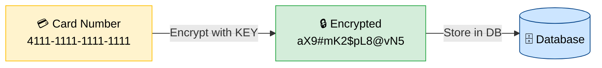

**New problem:** Where do you store the KEY?

---

## 2. The Core Problem — Where to Store Keys?

### All the Bad Options

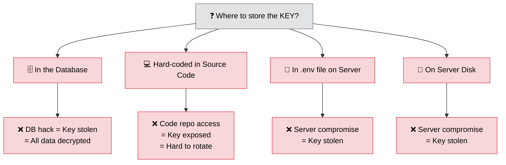

> **Core Insight:** The key is the most sensitive piece of data. If it leaks — ALL encrypted data is compromised instantly.

### The Comparison Table

| Storage Location | Safe? | Risk |
|---|---|---|
| Same Database | ❌ | DB leak = key stolen |
| Hard-coded in code | ❌ | Code leak = key stolen, hard to rotate |
| `.env` / disk | ❌ | Server compromise = key stolen |
| **Dedicated KMS** | ✅ | Best option |

---

## 3. How KMS Works — Basic Flow

Instead of storing the key yourself, all encrypt/decrypt work is **delegated to KMS**.

### Encryption Flow

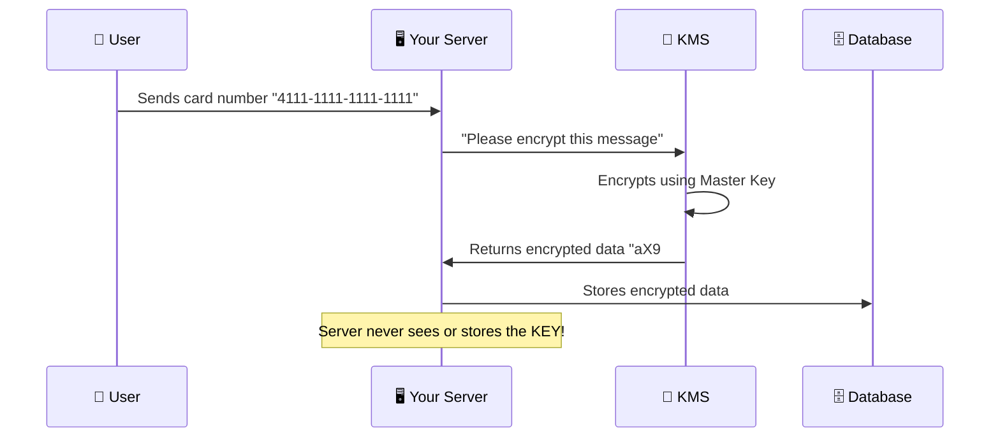

### Decryption Flow

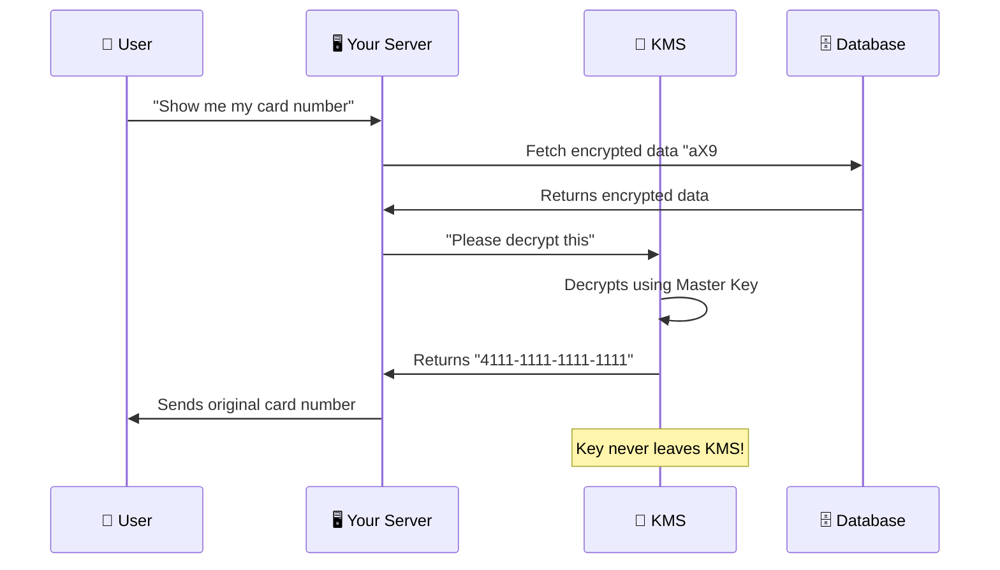

> ✅ **Why is this safe?** Your server never holds the key. Even if DB + Server are hacked, the attacker only gets encrypted data — useless without the KMS key.

---

## 4. Envelope Encryption

### The Scalability Problem

If you have **1 million messages**, you can't send all of them to KMS one by one — **too slow, too much load**.

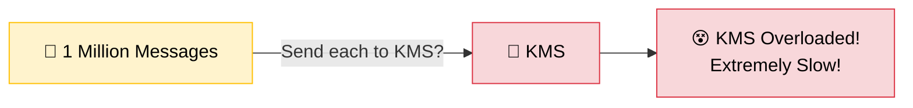

### The Solution — Envelope Encryption

KMS gives you a **Data Encryption Key (DEK)**. You encrypt data locally using DEK, then store the **encrypted DEK** (not the plain DEK).

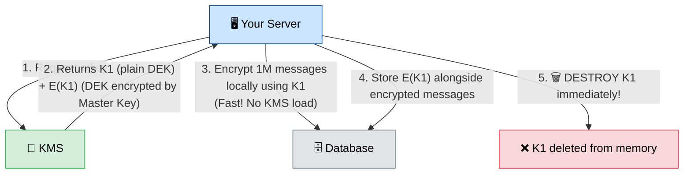

### What Gets Stored in the Database

| Column | Value | Description |
|---|---|---|
| `message_id` | `msg_001` | Identifier |
| `encrypted_message` | `xK9#mP2...` | Data encrypted with K1 |
| `encrypted_key` | `E(K1)` | K1 encrypted by Master Key ✅ Safe to store |

> ⚠️ **Never store plain K1!** Always destroy it after use. Only `E(K1)` goes to the DB.

### Decryption Using Envelope Encryption

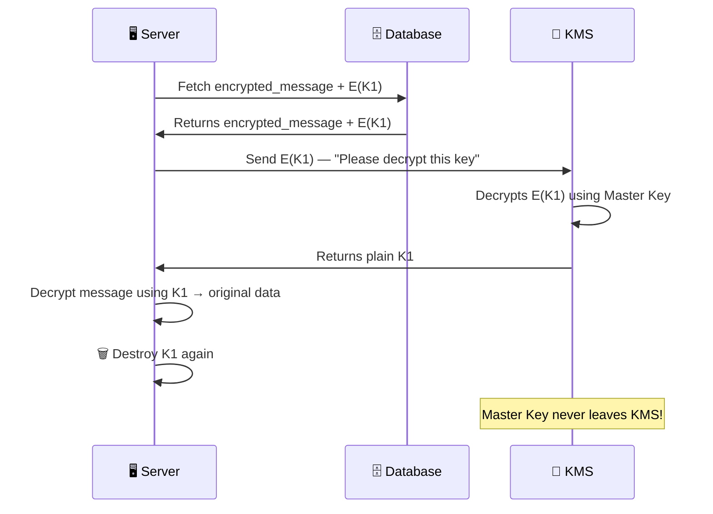

---

## 5. Blast Radius — Limiting Damage

### The Problem with One Key for Everything

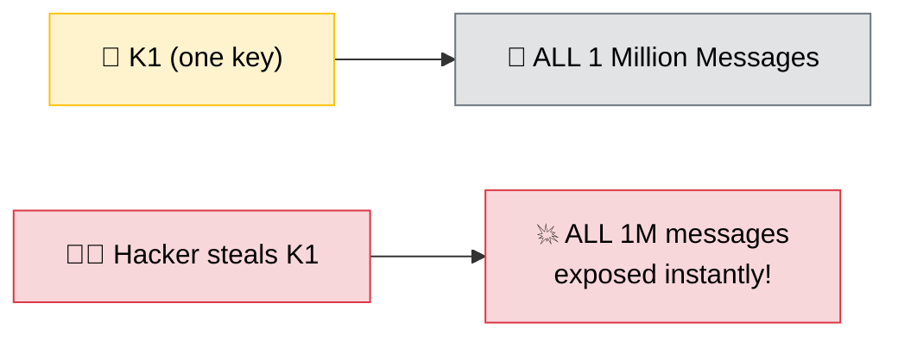

> This is called a **huge blast radius** — one compromise = everything lost.

### The Fix — Use Different Keys Per Batch

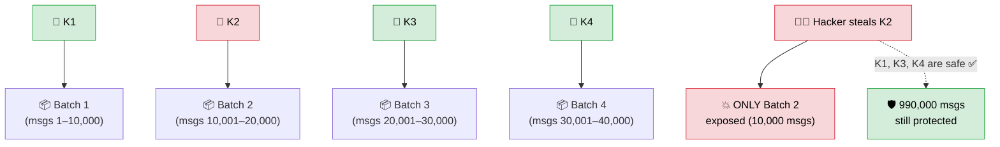

### Tradeoff — Batch Size vs Performance

| Strategy | Security | Performance | Blast Radius |
|---|---|---|---|
| 1 key for ALL messages | ❌ Dangerous | ✅ Fast | 💥 Huge (all data) |
| 1 key per BATCH (10k msgs) | ✅ Good balance | ✅ Fast | ✅ Small (10k msgs) |
| 1 key per MESSAGE | ✅ Best security | ❌ Very slow | ✅ Minimal (1 msg) |

> **Best Practice:** Use one key per batch. Balance between security and performance.

---

## 6. Master Key Rotation

### The Risk of a Static Master Key

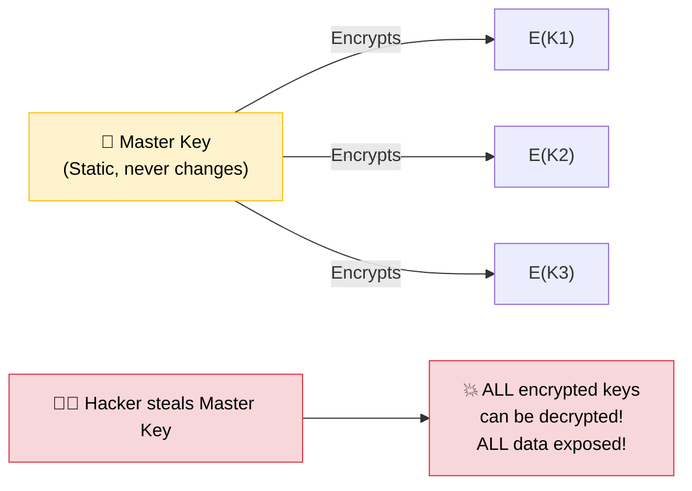

### Solution — Rotate Master Key Every 90/180 Days

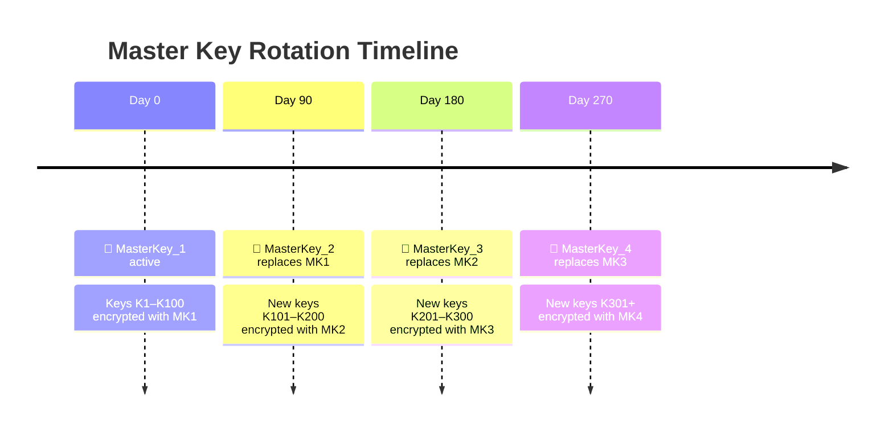

### Benefits of Key Rotation

| Without Rotation | With Rotation (every 90 days) |
|---|---|
| One stolen master key = everything lost forever | Only ~90 days of data at risk |
| Hacker has permanent unlimited access | Key useless after next rotation |
| No time limit on attack | Attack window is limited |
| No way to recover | Can re-encrypt and recover |

### Incident Response If Master Key is Stolen

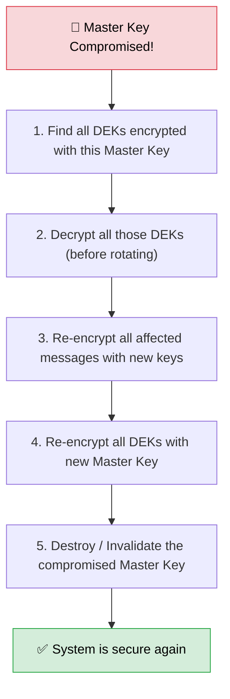

---

## 7. Server Authentication with KMS

### The Problem

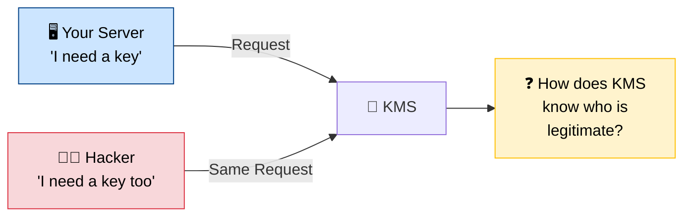

### Why Simple Solutions Fail

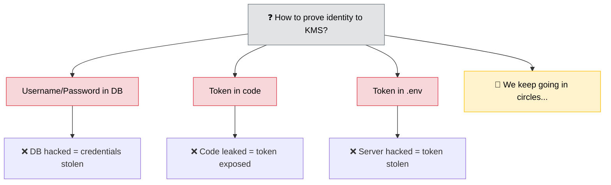

### The AWS Solution — Same Account = Automatic Trust

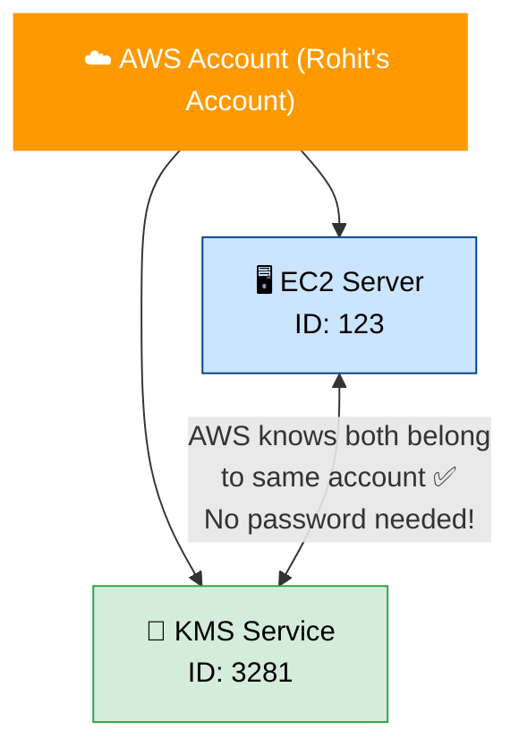

### How the Token Works (IAM Role)

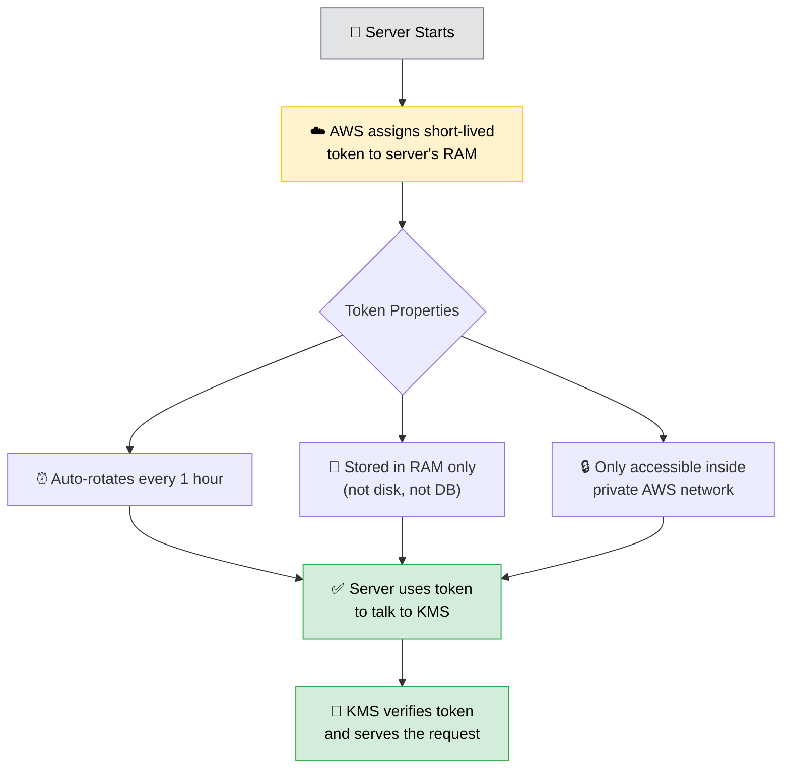

### Security Layers of KMS

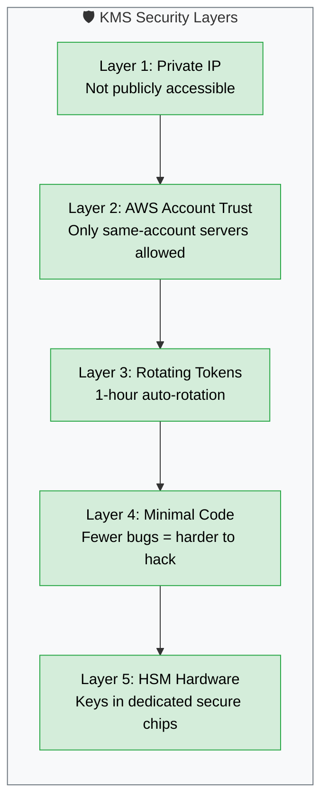

---

## 8. AWS KMS — Real World Example

### Storing Your OpenAI API Key Securely

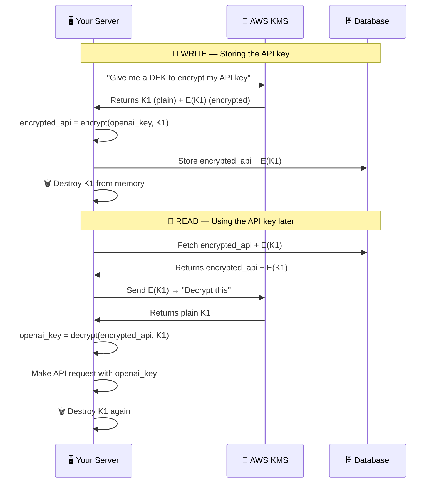

### AWS Services Involved

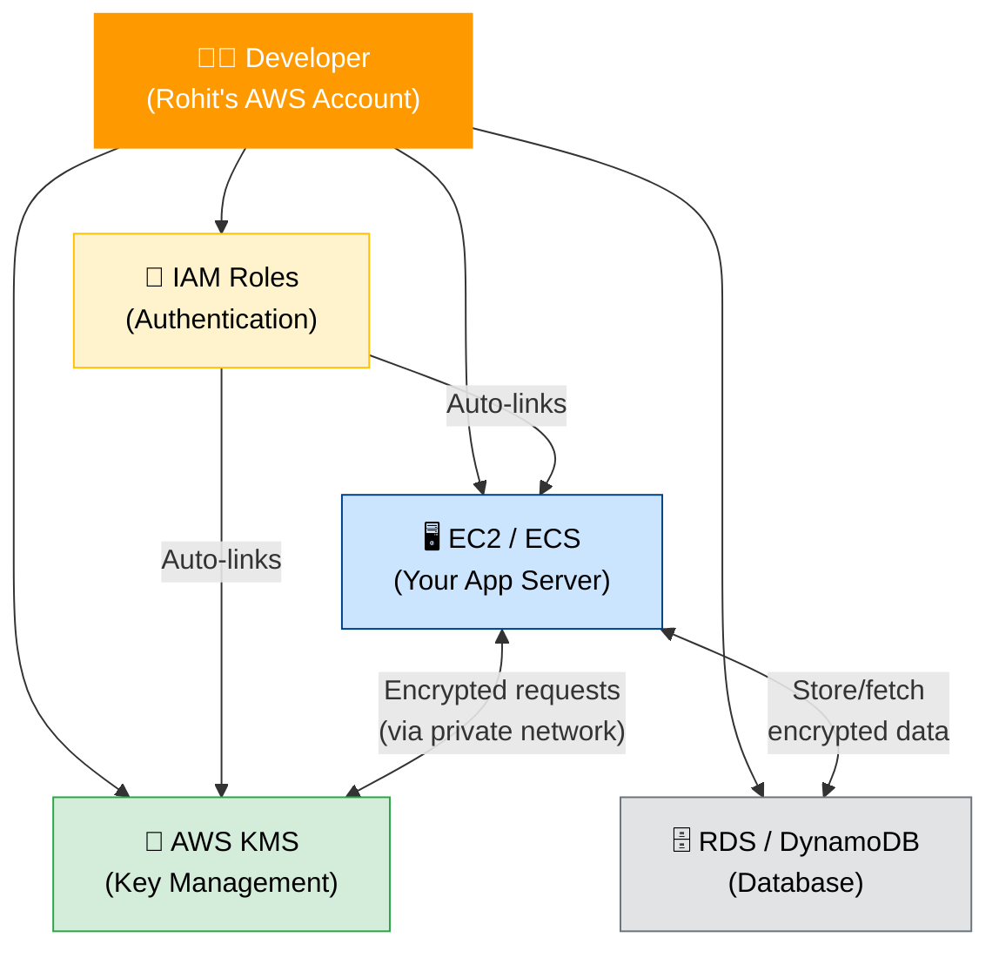

---

## 9. Key Concepts Cheat Sheet

| Term | Full Form | Meaning |
|---|---|---|
| **KMS** | Key Management System | A dedicated secure service for storing & using cryptographic keys |
| **DEK** | Data Encryption Key | Key generated by KMS; you use it to encrypt your actual data locally |
| **Master Key** | — | Top-level key inside KMS; used to encrypt/decrypt DEKs |
| **Envelope Encryption** | — | Encrypting a DEK with the Master Key so it's safe to store |
| **E(K1)** | Encrypted K1 | Encrypted form of DEK; safe to store in DB; useless without Master Key |
| **Blast Radius** | — | How much data is exposed if a key is stolen. Smaller = better |
| **Key Rotation** | — | Periodically replacing keys to limit the exposure window |
| **HSM** | Hardware Security Module | Physical chip that stores keys with extreme physical security |
| **IAM Role** | Identity & Access Management | AWS system that lets services authenticate each other without passwords |
| **Short-lived Token** | — | Temporary 1-hour credential stored only in RAM; auto-rotated by AWS |

---

### 🧠 The Mental Model

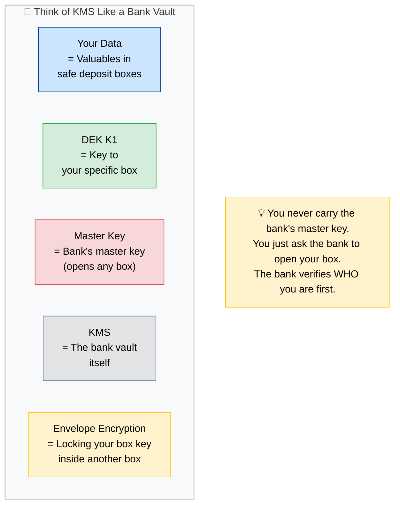

---

### 🌐 Real-World KMS Services

| Provider | Service |
|---|---|
| ☁️ AWS | AWS KMS (Key Management Service) |
| 🟦 Google Cloud | Cloud KMS |
| 🟪 Azure | Azure Key Vault |
| 🏗️ HashiCorp | Vault |

---

*Notes based on KMS concepts in System Design & Security*  
*Topics: Envelope Encryption · Blast Radius · Key Rotation · AWS IAM · Master Keys · HSM*
