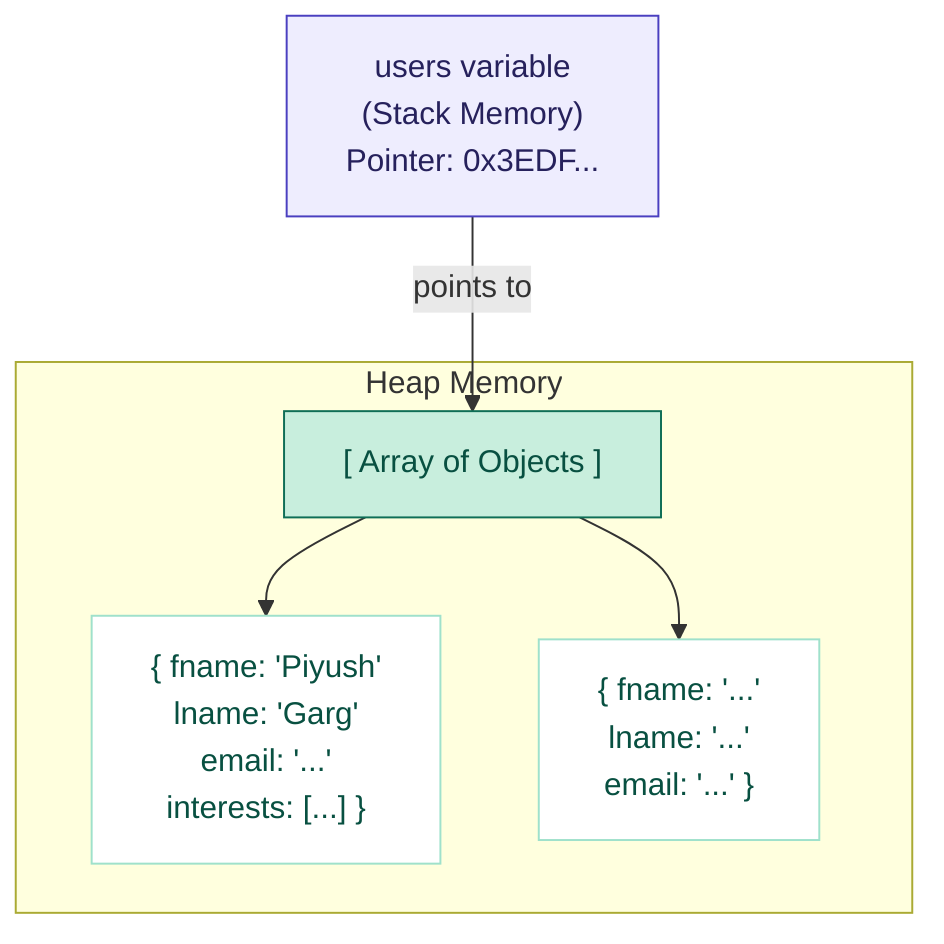
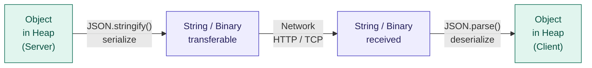
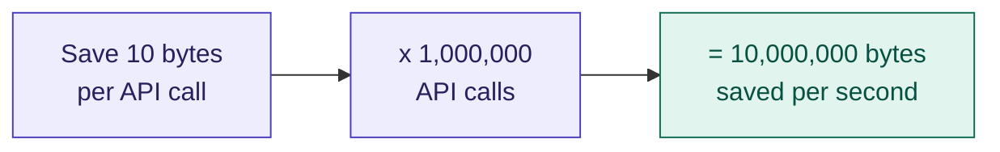
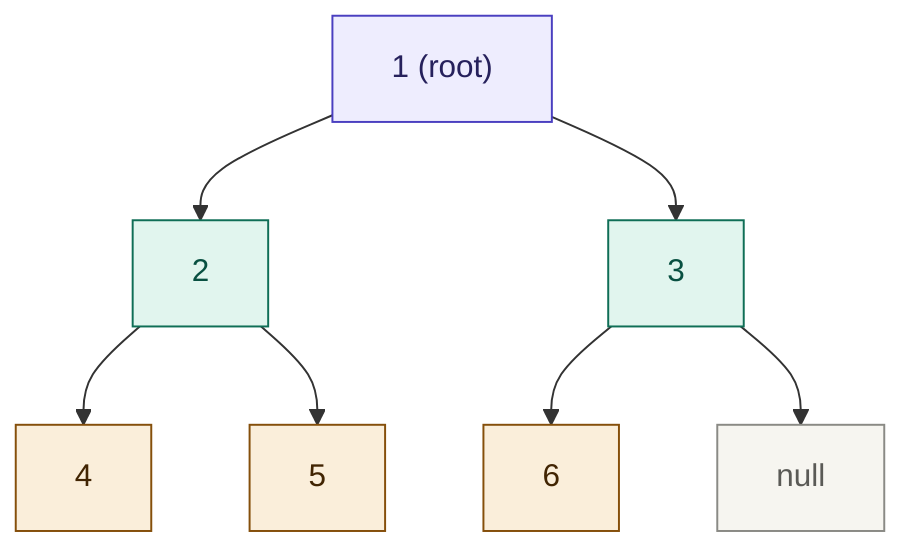
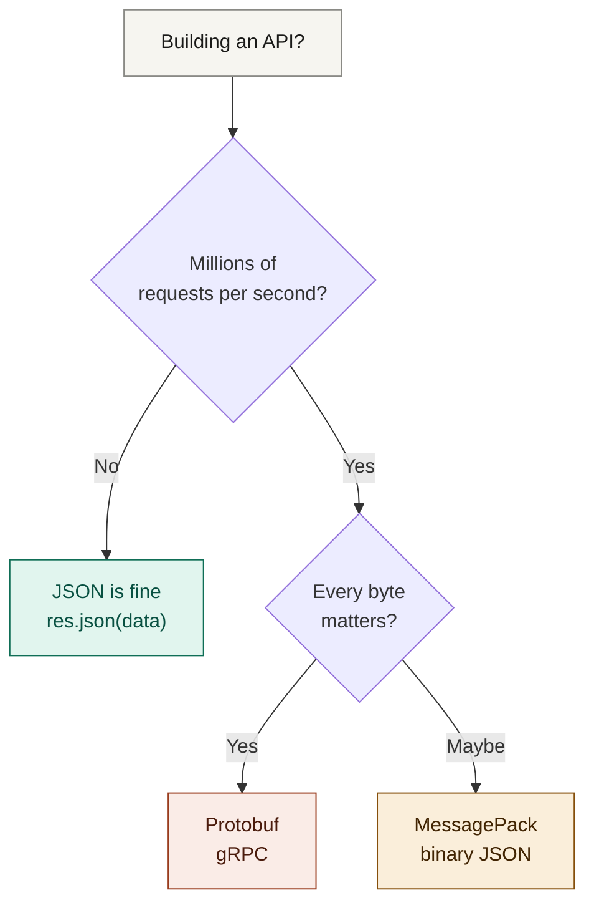

# Serialization & Deserialization — Why JSON Exists

> Notes from: *"JSON Is Dead"* — video by Piyush Garg

---

## 1. The Core Problem — Memory vs Network

When your server stores data, it lives in **two places in RAM**:

> **Key insight:** The `users` variable is just a pointer — a memory address like `0x3EDF...`. That address is meaningless to another machine. **You cannot send heap memory over a network.**

---

## 2. Serialization & Deserialization Flow

### How JSON.parse() works internally

The parser scans the string **character by character**:

---

## 3. The Size Problem at Scale

JSON is human-readable but **not the most efficient** format. Every key name, every quote, every colon uses bytes on the wire.

### Real demo — same user data, two serializers:

| Serializer | Bytes used |
|---|---|
| `JSON.stringify(users)` | **969 bytes** |
| `msgpack.encode(users)` | **58 bytes** |

MessagePack is ~94% smaller for the same data.

### Why size matters:

---

## 4. Serializers Compared

| Serializer | Format | Speed | Size | Best for |
|---|---|---|---|---|
| **JSON** | Human-readable text | ~9500 ns/op | Largest | REST APIs, general use |
| **MessagePack** | Binary | Faster | ~40% smaller | High-throughput APIs |
| **Protobuf** | Binary + schema | Very fast | Very compact | gRPC, microservices |
| **Custom** | Anything | Depends | Depends | Special cases |

> **gRPC never uses JSON.** It uses **Protobuf** as its serializer — binary, schema-defined, much faster and smaller.

---

## 5. Both Sides Must Agree

> **Mismatch = corrupt or unreadable data.** JSON is popular because every language supports it natively — serialize in Node.js, deserialize in Go, Python, Java, etc.

---

## 6. DSA Connection — Serializing a Binary Tree

A binary tree is a heap data structure. It **cannot** be sent over a network directly. This is the real reason the classic "Serialize and Deserialize a Binary Tree" problem exists.

**Serialized string:** `"B:1,2,3,4,5,n,6"` — now transferable over the network ✓

The deserializer reads this string and reconstructs the identical tree on the client.

---

## 7. When to Use What

---

## Key Takeaways

- You **cannot send heap memory** over a network — only transferable (primitive) data
- **Serialization** = convert in-memory object → transferable bytes/string
- **Deserialization** = reconstruct the object on the receiving end
- **JSON** is just one serializer — Protobuf and MessagePack are faster/smaller alternatives
- **CPU cost** of serializing/deserializing also matters — a slow serializer bottlenecks your server
- At millions of requests, even a few saved bytes per call compound enormously
- The DSA "serialize a binary tree" problem exists for exactly this reason

---

*Source: "JSON Is Dead" — video by Piyush Garg*
