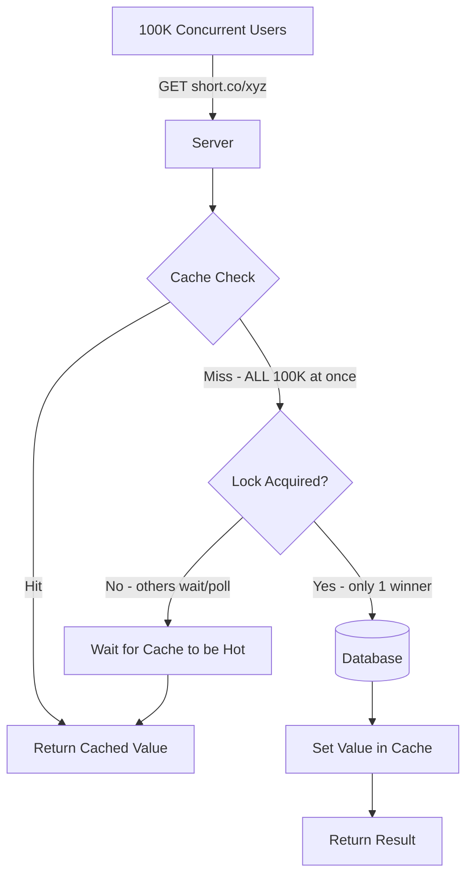
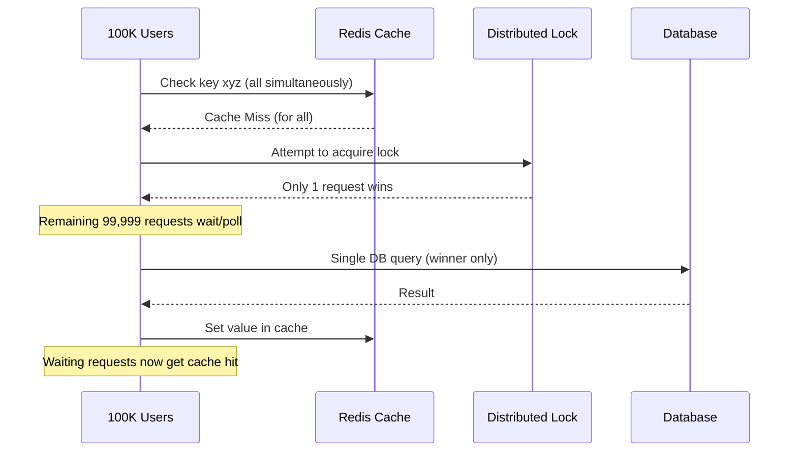

# Thundering Herd Problem (Cache Stampede) — System Design Notes

> **Summary:** The Thundering Herd Problem occurs when a massive number of concurrent processes/requests simultaneously hit a backend resource (DB, service, connection pool) — usually right after a cache miss, an expiry, or a system recovering from downtime — causing latency spikes, cascading failures, and potential outages. This is a frequently asked System Design interview topic.

---

## Table of Contents
1. [What is the Thundering Herd Problem](#what-is-the-thundering-herd-problem)
2. [Motivating Example: URL Shortener](#motivating-example-url-shortener)
3. [How Caching Helps (Read-Through Cache)](#how-caching-helps-read-through-cache)
4. [Where It Breaks: The Race Condition](#where-it-breaks-the-race-condition)
5. [Common Real-World Triggers](#common-real-world-triggers)
6. [Prevention & Mitigation Strategies](#prevention--mitigation-strategies)
7. [Architecture Diagram](#architecture-diagram)
8. [Comparison Table of Solutions](#comparison-table-of-solutions)
9. [Interview Q&A](#interview-qa)
10. [Quick Revision Checklist](#quick-revision-checklist)

---

## What is the Thundering Herd Problem

**Definition:** A performance-degrading phenomenon (also called a **cache stampede**) where a massive, synchronized batch of processes or user requests simultaneously hit a backend resource. This instantly overwhelms the system, causing:
- Latency spikes
- Cascading failures
- Potential downtime

Mental model: imagine a *herd of bulls* charging toward you all at once instead of arriving one by one — the system can handle a trickle, not a stampede.

---

## Motivating Example: URL Shortener

### Basic Architecture (no caching)

- **User** → sends `POST /shorturl` with `{ originalUrl: "https://..." }`
- **Server** generates a short code and inserts a record into a **DB**
- DB might already hold e.g. **90,000+ records**

### Read Path (the bottleneck)

- User hits `https://short.co/xyz`
- Request → **Server** → reads `xyz` → looks up in **DB** → DB returns original URL → server redirects user

**Bottleneck:** Every single redirect requires a DB lookup. As the table grows (90K → 900K+ records), lookups get slower even with indexes (and indexing a huge, high-write table has its own storage/perf cost). Since a URL shortener's core value proposition is speed, this DB-per-request pattern doesn't scale.

---

## How Caching Helps (Read-Through Cache)

**Fix:** Add a cache (e.g. Redis) in front of the DB.

**Flow:**
1. Check cache for the code first
2. If **cache hit** → return cached value directly (fast)
3. If **cache miss** → query DB → store result in cache (with a good TTL) → return result

### Pseudocode

```text
function resolve(code):
    if cache.has(code):
        return cache.get(code)          # cache hit — fast path
    else:
        result = db.find(code)          # cache miss — slow path
        cache.set(code, result)         # populate cache for next time
        return result
```

**Effect:** DB lookup latency (e.g. ~2 sec) collapses down to sub-second cache reads (e.g. ~100–300ms) once the value is cached. This pattern is called a **read-through cache**.

---

## Where It Breaks: The Race Condition

Scenario: cache is **completely empty** for a given key, and by chance **100,000 users** request the **same key at the exact same time**.

- All 100K requests hit the `if cache.has(code)` check
- All 100K get a **cache miss** simultaneously
- All 100K requests fall through to `db.find(code)` **in parallel**
- The DB gets hammered with 100K identical queries at once → **this is the Thundering Herd Problem**

**Compare with the "lucky" case:** if just *one* user had requested the key 1 second earlier, that single request would populate the cache, and the other 99,999 users arriving later would all get a fast cache hit. The problem is purely about **simultaneity**, not about caching being absent.

### Key Terms
- **Cache Hit** — data found in cache
- **Cache Miss** — data not found in cache, must go to source of truth

---

## Common Real-World Triggers

| Trigger | What Happens |
|---|---|
| **Cache Expiration** | A highly popular cached item (e.g. homepage banner) expires. Thousands of concurrent users instantly get a cache miss and bypass the cache, hitting the primary DB at the exact same moment. |
| **Synchronized Retries / Service Recovery** | System (e.g. DB) has a brief outage. All dependent services (auth, notification, email, etc.) had open connections. The moment DB comes back up, *all* services simultaneously try to reconnect/build a connection pool, overwhelming the DB again before it even stabilizes. |
| **Scheduled Cron Jobs** | Dozens of servers running heavy backend tasks all scheduled at the exact same time (e.g. everyone's cron fires at 2:00 PM). |
| **Flash Sales / Traffic Spikes** | E.g. an Amazon sale opening at 12:00 PM — massive concurrent hits on the "Buy Now" button at the exact same instant. |

---

## Prevention & Mitigation Strategies

There's **no single universal fix** — the right solution depends on *what* is causing the herd. Below are the main techniques:

### 1. Distributed Locking (Mutex / Acquire Lock)
- Before querying the DB, a process must **acquire a lock**.
- Only the process holding the lock is allowed to do `db.find()`.
- All other concurrent requests wait (via polling or blocking) until the lock-holder populates the cache.
- Once the cache is "hot," waiting requests are served from cache.
- Effect: out of 100K simultaneous requests, only **1** actually reaches the DB.

### 2. Request Coalescing / Single-Flight
- If multiple requests arrive for the same missing key at the same time, the system allows **only one in-flight request** to query the DB.
- All other requests for that key are held/merged and served the result of that single in-flight call once it completes.
- Conceptually similar to locking, but framed around deduplicating identical concurrent requests rather than a generic mutex.

### 3. Stale-While-Revalidate
- Serve the **stale (old) cached data** immediately to the user.
- Simultaneously trigger a **background refresh** of the cache.
- User never waits on a cold cache. (Not always applicable — e.g. doesn't fit the URL-shortener case well, but works great for content like homepage banners.)

### 4. Jitter (Randomized Backoff)
- Instead of telling all failed/retrying clients to retry after a fixed interval, assign each a **random delay** (e.g. one retries after 2s, another after 6s, another after 9s, etc.).
- Prevents synchronized retries from re-flooding the system all at once.
- Commonly combined with exponential backoff strategies.

### 5. Probabilistic Early Recomputation
- Instead of waiting for the cache to fully expire and then reacting to a stampede, **proactively refresh** the cache slightly *before* expiry (probabilistically, based on age/TTL).
- For predictable "hot" keys (e.g. homepage banner), a background process can refresh the cache the moment it expires — don't wait for a user request to trigger the refill.

### 6. Rate Limiting
- Apply (distributed) rate limiting to cap how many requests can hit a resource in a given window, protecting the backend from being overwhelmed even under synchronized load.

---

## Architecture Diagram





---

## Comparison Table of Solutions

| Strategy | Best For | Trade-off |
|---|---|---|
| Distributed Lock / Mutex | Cache-miss stampedes on a specific key | Adds coordination overhead; other requests must wait |
| Request Coalescing (Single-Flight) | Deduplicating identical concurrent DB calls | Similar to locking; needs in-app or proxy support |
| Stale-While-Revalidate | Content where slightly stale data is acceptable (banners, feeds) | Not suitable when data must always be exact/fresh |
| Jitter / Randomized Backoff | Synchronized retries after an outage | Adds latency variance; doesn't reduce total load, just spreads it |
| Probabilistic Early Recomputation | Predictable, high-traffic "hot" keys | Extra background compute; needs to know TTL patterns |
| Rate Limiting | Any general spike protection | Can reject legitimate traffic if not tuned well |

---

## Interview Q&A

**Q1: What is the Thundering Herd Problem?**
A: A performance-degrading phenomenon where a large number of processes/requests simultaneously hit a backend resource (often right after a cache miss or system recovery), causing latency spikes, cascading failures, and possible downtime.

**Q2: Why does adding a cache alone not fully solve this problem?**
A: Because if the cache is empty and many requests arrive at the *exact same time*, they all experience a cache miss simultaneously and all fall through to the database at once — caching only helps when requests are staggered, not concurrent.

**Q3: How does a distributed lock prevent the thundering herd?**
A: By ensuring only one process can acquire the lock and query the database on a cache miss; all other concurrent requests wait until that process populates the cache, after which they're served from cache instead of hitting the DB.

**Q4: What's the difference between a distributed lock and request coalescing (single-flight)?**
A: Conceptually similar — both ensure only one query reaches the DB — but single-flight/coalescing is specifically about deduplicating identical in-flight requests for the same key, while locking is a more general mutual-exclusion mechanism.

**Q5: When would you use jitter instead of a lock?**
A: When the problem is caused by many independent services/clients retrying or reconnecting after an outage at the same fixed interval — jitter randomizes retry timing so they don't all hit the recovering system at once.

**Q6: Give a real-world example of the thundering herd problem outside of caching.**
A: A database goes down briefly; when it comes back online, all dependent services (auth, notifications, email, etc.) simultaneously try to open new connections/connection pools, overwhelming the DB again before it can stabilize.

**Q7: What is stale-while-revalidate and when would you avoid it?**
A: A strategy where stale cached data is served immediately to the user while the cache is refreshed in the background. It's ideal for content like homepage banners but not appropriate where returning exactly correct/fresh data matters (e.g. a URL shortener's mapping).

**Q8: What causes a cache stampede from a "cache expiration" perspective?**
A: When a highly popular cached item expires, all concurrent users requesting it at that moment experience a cache miss simultaneously and bypass the cache, hitting the primary DB at the same time.

---

## Quick Revision Checklist

- [ ] Can define Thundering Herd / Cache Stampede in one line
- [ ] Understand cache hit vs cache miss
- [ ] Can explain the URL shortener example end-to-end (write path + read path)
- [ ] Know why plain read-through caching isn't enough under concurrency
- [ ] Can list 4 real-world triggers: cache expiration, synchronized retries/outage recovery, cron jobs, flash sales
- [ ] Can explain distributed locking as the primary fix
- [ ] Know request coalescing / single-flight as related concept
- [ ] Know stale-while-revalidate and when it's/isn't appropriate
- [ ] Can explain jitter/randomized backoff and why it helps with retries
- [ ] Know probabilistic early recomputation for predictable hot keys
- [ ] Understand rate limiting as a general safety net
